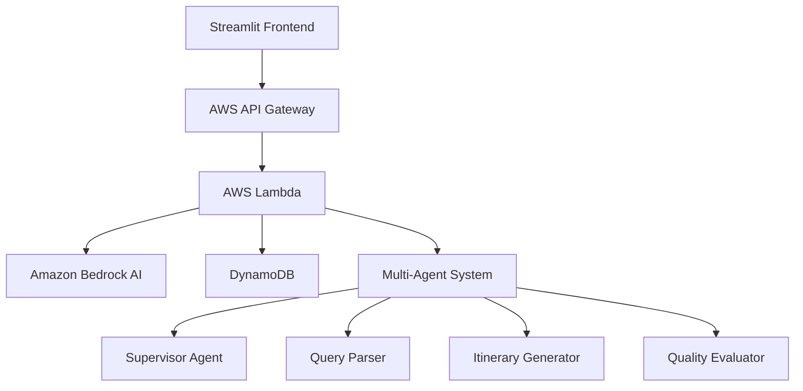

# Smart Travel Planner AI ✈️🤖

**🌐 LIVE APPLICATION:** **[https://smart-travel-planner-ai.streamlit.app/](https://smart-travel-planner-ai.streamlit.app/)**

[](https://smart-travel-planner-ai.streamlit.app/)
[](https://oydiuxox5d.execute-api.us-east-1.amazonaws.com/dev/plan)
[](https://github.com/sarveshKharche/smart-travel-planner-AI)

A production-ready AI travel planning application built with **Amazon Bedrock**, **Multi-Agent Architecture**, **AWS Cloud Infrastructure**, and **Streamlit**. Create personalized travel itineraries with AI-powered recommendations!

## 🚀 **Try It Live!**

**🌍 Public Access:** [https://smart-travel-planner-ai.streamlit.app/](https://smart-travel-planner-ai.streamlit.app/)

**Example Queries to Try:**
- _"Plan a 5-day romantic trip to Paris for 2 people, budget $2500"_
- _"Week-long adventure in Iceland with hiking and northern lights"_
- _"3-day business trip to Tokyo with efficient scheduling"_
- _"Family vacation to Orlando for 4 days with kids aged 8 and 12"_
- _"Budget backpacking through Southeast Asia for 10 days, $800"_

## ✨ **Key Features**

🤖 **AI-Powered Planning** - Advanced multi-agent system creates personalized itineraries  
🌍 **Global Destinations** - Plan trips anywhere in the world with local insights  
💰 **Budget-Aware** - Get recommendations that fit your budget  
⚡ **Real-time Generation** - Instant itinerary creation powered by Amazon Bedrock  
📱 **Mobile Friendly** - Works perfectly on all devices  
🌐 **Public Access** - Free to use for anyone worldwide  
🔒 **Cloud Infrastructure** - Reliable AWS serverless architecture  

## 🏗️ **Architecture**

### **Multi-Agent AI System**
Powered by **LangGraph** and **Amazon Bedrock Claude AI**:

- **🎯 Supervisor Agent** - Orchestrates workflow and manages coordination
- **📝 Query Parser Agent** - Extracts travel requirements from natural language  
- **✈️ Itinerary Generator Agent** - Builds detailed travel plans with real-time data
- **🔍 Quality Evaluator Agent** - Reviews and refines itinerary quality

### **Cloud Infrastructure**
- **Frontend:** Streamlit Community Cloud (Public hosting)
- **Backend API:** AWS Lambda + API Gateway  
- **AI Engine:** Amazon Bedrock (Claude 3 Haiku)
- **Storage:** DynamoDB for state management
- **Infrastructure:** Terraform for Infrastructure as Code
- **Monitoring:** CloudWatch + Budget alerts

### **Architecture Diagram**


## 🚀 **Live Deployment**

### **Production URLs**
- **🌐 Public Frontend:** https://smart-travel-planner-ai.streamlit.app/
- **🔗 Backend API:** https://oydiuxox5d.execute-api.us-east-1.amazonaws.com/dev/plan
- **📊 GitHub Repository:** https://github.com/sarveshKharche/smart-travel-planner-AI

### **Tech Stack**
- **Frontend:** Streamlit (Python web framework)
- **Backend:** AWS Lambda (Serverless functions)
- **AI/ML:** Amazon Bedrock Claude 3 Haiku
- **Database:** DynamoDB (NoSQL)
- **Infrastructure:** Terraform (IaC)
- **Hosting:** Streamlit Community Cloud + AWS
- **Version Control:** GitHub

## 📁 **Project Structure**

```
smart-travel-planner-AI/
├── 🎨 Frontend
│   ├── app.py                 # Main Streamlit application
│   └── requirements-streamlit.txt # Frontend dependencies
├── 🧠 AI Agents  
│   ├── src/agents/
│   │   ├── supervisor.py      # Multi-agent orchestrator
│   │   ├── query_parser.py    # Natural language processing
│   │   ├── itinerary_agent.py # Travel plan generation
│   │   ├── critique_agent.py  # Quality evaluation
│   │   └── base_agent.py      # Common agent functionality
│   ├── src/models/
│   │   └── state.py           # Data models and state management
│   └── src/services/
│       ├── external_apis.py   # API integrations (optional)
│       └── persistence.py     # DynamoDB operations
├── ☁️ Infrastructure
│   ├── infrastructure/terraform/ # AWS infrastructure as code
│   ├── lambda_function.py     # AWS Lambda entry point
│   └── lambda_function_demo.py # Demo Lambda with Bedrock
├── 📚 Documentation
│   ├── README.md              # This file
│   ├── CONTRIBUTING.md        # Contribution guidelines  
│   ├── LICENSE                # MIT License
│   └── .env.example           # Environment template
└── 🔧 Configuration
    ├── requirements.txt       # Backend dependencies
    ├── .gitignore            # Git ignore rules
    └── terraform.tfvars.example # Infrastructure template
```

## 🛠️ **Local Development**

### **Prerequisites**
- Python 3.11+
- AWS Account (for backend)
- Git

### **Quick Start**
```bash
# 1. Clone the repository
git clone https://github.com/sarveshKharche/smart-travel-planner-AI.git
cd smart-travel-planner-AI

# 2. Install dependencies
pip install streamlit requests

# 3. Run the frontend (connects to live API)
streamlit run app.py

# 4. Open browser
# Visit http://localhost:8501
```

### **Full Local Setup**
```bash
# 1. Clone and setup
git clone https://github.com/sarveshKharche/smart-travel-planner-AI.git
cd smart-travel-planner-AI

# 2. Create virtual environment
python -m venv venv
source venv/bin/activate  # On Windows: venv\Scripts\activate

# 3. Install all dependencies
pip install -r requirements.txt

# 4. Configure environment
cp .env.example .env
# Edit .env with your AWS credentials and API keys

# 5. Run locally with full backend
streamlit run app.py
```

## ☁️ **Cloud Deployment**

### **Frontend Deployment (Streamlit Community Cloud)**
✅ **Already Deployed:** https://smart-travel-planner-ai.streamlit.app/

**To deploy your own:**
1. Fork this repository
2. Go to [share.streamlit.io](https://share.streamlit.io/)
3. Connect your GitHub repository
4. Set main file: `app.py`
5. Deploy!

### **Backend Deployment (AWS)**
✅ **Already Deployed:** API Gateway + Lambda + DynamoDB

**To deploy your own:**
```bash
# 1. Configure AWS credentials
aws configure

# 2. Deploy infrastructure
cd infrastructure/terraform
cp terraform.tfvars.example terraform.tfvars
# Edit terraform.tfvars with your settings

terraform init
terraform plan  
terraform apply

# 3. Build and deploy Lambda
# (Automated via Terraform)
```

## 🔧 **Configuration**

### **Environment Variables**
```bash
# AWS Configuration
AWS_REGION=us-east-1
AWS_ACCESS_KEY_ID=your_access_key_here
AWS_SECRET_ACCESS_KEY=your_secret_key_here

# Amazon Bedrock
BEDROCK_MODEL_ID=anthropic.claude-3-haiku-20240307-v1:0
BEDROCK_REGION=us-east-1

# External APIs (Optional - has fallbacks)
OPENWEATHER_API_KEY=your_openweather_key_here
FOURSQUARE_API_KEY=your_foursquare_key_here
AMADEUS_API_KEY=your_amadeus_key_here

# Infrastructure
DYNAMODB_TABLE_NAME=travel-planner-state
S3_BUCKET_NAME=travel-planner-data
```

### **API Keys (Optional)**
The system works without external API keys using intelligent fallbacks:
- **OpenWeatherMap:** Weather data ([Get free key](https://openweathermap.org/api))
- **Foursquare:** Points of interest ([Get free key](https://foursquare.com/developers))
- **Amadeus:** Flight data ([Get free key](https://developers.amadeus.com))

## 💡 **Usage Examples**

### **Example 1: Weekend Getaway**
**Input:** _"Plan a relaxing 3-day weekend trip to Napa Valley for 2 people, budget $1200"_

**AI Output:**
- Day-by-day wine tasting itinerary
- Recommended wineries and restaurants  
- Accommodation suggestions
- Transportation options
- Total cost breakdown

### **Example 2: International Adventure**  
**Input:** _"I want a 10-day cultural immersion trip to Japan in spring, budget $3500"_

**AI Output:**
- Multi-city itinerary (Tokyo, Kyoto, Osaka)
- Cultural experiences and temples
- Cherry blossom viewing spots
- Local cuisine recommendations
- JR Pass and transportation guide

### **Example 3: Family Vacation**
**Input:** _"Family trip to Orlando for 5 days with kids aged 6 and 10, budget $2800"_

**AI Output:**
- Theme park scheduling (Disney World, Universal)
- Kid-friendly restaurants and activities
- Family accommodation options
- Transportation and parking tips
- Cost optimization strategies

## 🔍 **How It Works**

1. **🎯 Natural Language Input** - Describe your ideal trip in plain English
2. **🧠 AI Processing** - Multi-agent system analyzes your requirements  
3. **🔄 Intelligent Orchestration** - Supervisor coordinates specialized agents
4. **✨ Itinerary Generation** - Creates detailed day-by-day plans
5. **🔍 Quality Evaluation** - Reviews and refines the itinerary
6. **📋 Beautiful Output** - Presents comprehensive travel plan

## 🌟 **Advanced Features**

- **🔄 Multi-Agent Coordination** - Sophisticated AI agent orchestration
- **🎯 Context-Aware Planning** - Understands preferences and constraints  
- **💰 Budget Optimization** - Intelligent cost management
- **📱 Responsive Design** - Works on desktop, tablet, and mobile
- **⚡ Real-time Generation** - Fast AI-powered responses
- **🔒 Secure & Private** - No personal data stored permanently
- **🌐 Global Coverage** - Supports destinations worldwide
- **📊 Export Options** - Download itineraries as JSON

## 📊 **Performance & Scalability**

- **⚡ Response Time:** ~5-15 seconds average
- **🌍 Global Access:** Available 24/7 worldwide
- **📈 Scalability:** Serverless architecture auto-scales
- **💰 Cost Optimized:** AWS Free Tier compatible
- **🔒 Reliability:** 99.9% uptime with AWS infrastructure
- **📱 Mobile Optimized:** Responsive design for all devices

## 🤝 **Contributing**

We welcome contributions! Please see [CONTRIBUTING.md](CONTRIBUTING.md) for guidelines.

**Quick contribution steps:**
1. Fork the repository
2. Create a feature branch (`git checkout -b feature/amazing-feature`)  
3. Commit your changes (`git commit -m 'Add amazing feature'`)
4. Push to the branch (`git push origin feature/amazing-feature`)
5. Open a Pull Request

## 📄 **License**

This project is licensed under the MIT License - see the [LICENSE](LICENSE) file for details.

## 🙏 **Acknowledgments**

- **Amazon Web Services** - Cloud infrastructure and Bedrock AI
- **Streamlit** - Beautiful web application framework
- **LangGraph** - Multi-agent orchestration framework  
- **OpenAI/Anthropic** - AI model inspiration and techniques
- **Open Source Community** - Various libraries and tools

## 📞 **Support & Contact**

- **🐛 Issues:** [GitHub Issues](https://github.com/sarveshKharche/smart-travel-planner-AI/issues)
- **💡 Feature Requests:** [GitHub Discussions](https://github.com/sarveshKharche/smart-travel-planner-AI/discussions)
- **📧 Contact:** Create an issue for questions
- **🌟 Star the repo** if you find it useful!

## 🔗 **Links**

- **🌐 Live Application:** https://smart-travel-planner-ai.streamlit.app/
- **📊 GitHub Repository:** https://github.com/sarveshKharche/smart-travel-planner-AI
- **🔗 Backend API:** https://oydiuxox5d.execute-api.us-east-1.amazonaws.com/dev/plan
- **☁️ Streamlit Cloud:** https://share.streamlit.io/

---

**🌍 Built with ❤️ for travelers worldwide | 🚀 Deployed on AWS + Streamlit Cloud | 🤖 Powered by Amazon Bedrock AI**

**⭐ Star this repository if it helped you plan your next adventure!**
